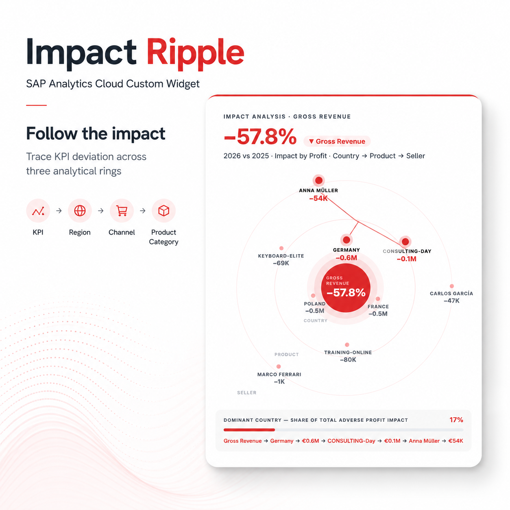

# Impact Ripple — SAC Custom Widget

A SAP Analytics Cloud Custom Widget that visualizes a KPI deviation propagating outward through three analytical rings and highlights the dominant impact path.

Instead of piecing together the story across multiple charts, Impact Ripple shows the analysis in one connected visual flow:

```
KPI → Ring 1 → Ring 2 → Ring 3
```

The actual dimensions are freely configurable, for example:

```
Region → Channel → Product Category
```



The runtime analysis is deterministic and does not call an LLM or generative AI service. No backend is required.

---

## What it does

- Animates a KPI deviation from a central node outward across three configurable analytical rings
- Identifies the dominant adverse contributor at each ring level
- Connects the dominant path with animated SVG lines
- Shows the impact share of the dominant first-ring contributor relative to total adverse impact
- Renders a configurable path summary at the bottom

---

## Files

| File | Purpose |
|------|---------|
| `impact-ripple.zip` | Upload this to SAC |
| `index.json` | Widget manifest |
| `main.js` | Widget source |

---

## Installation

1. Download `impact-ripple.zip`
2. In SAC: **Files → Upload** → select the ZIP
3. Add the widget to a story page
4. Connect your data source
5. Bind measures and dimensions in the correct order (see below)

> **The order of dimensions is critical.** The widget uses position to determine which dimension is the time dimension and which are the analytical rings.

---

## Required Data Binding

### Measures

| Position | Role |
|----------|------|
| 1st measure | KPI Measure |
| 2nd measure *(optional)* | Impact Measure |

**1-measure mode:** The same measure is used for both the KPI change header and the ripple impact analysis.

**2-measure mode:** The first measure drives the KPI delta shown in the header. The second measure is used for the impact analysis in the rings.

### Dimensions

| Position | Role |
|----------|------|
| 1st dimension | **Time** (e.g. Year) — must be placed first |
| 2nd dimension | Ring 1 |
| 3rd dimension | Ring 2 |
| 4th dimension | Ring 3 |

> The first dimension must be a valid time dimension. The widget validates this on binding and shows a configuration error if a non-time dimension is placed first.

> At least two valid time periods must be present in the data. The two most recent periods are used for the prior/current comparison.

---

## Configuration Examples

### 1-Measure Example

```
Measure:      Gross Margin

Dimensions:   Year
              Region
              Channel
              Product Category
```

The header shows the Gross Margin delta. The rings analyze impact using the same Gross Margin values.

### 2-Measure Example

```
KPI Measure:    Gross Sales
Impact Measure: Gross Margin

Dimensions:     Year
                Region
                Channel
                Product Category
```

The header shows the Gross Sales delta. The rings analyze and rank contributors by their Gross Margin impact. The subline reads: *Impact by Gross Margin*.

---

## Properties

| Property | Default | Description |
|----------|---------|-------------|
| `kpiLabel` | *(inferred from binding)* | Override KPI label |
| `kpiUnit` | `%` | Unit suffix for KPI value |
| `ring1Label` | *(inferred from binding)* | Override Ring 1 label |
| `ring2Label` | *(inferred from binding)* | Override Ring 2 label |
| `ring3Label` | *(inferred from binding)* | Override Ring 3 label |
| `impactUnit` | `€` | Currency prefix for impact values |
| `pathSummary` | *(auto-generated)* | Static override for the path pill text |

Labels are automatically inferred from the SAC binding metadata. Manual overrides are only needed if the inferred labels are not suitable.

---

## Features

- Animated ripple build-up across three rings
- 3 configurable analytical rings
- Conditional dominant path with animated SVG lines
- Dynamic KPI and binding labels inferred from SAC metadata
- 1- or 2-measure mode
- Automatic impact share calculation
- Collision handling for secondary nodes along the ring radius
- Deterministic node positioning based on label hash
- Binding validation: rejects non-time dimension in first slot
- Responsive scaling within SAC story canvas
- Demo fallback when no data binding is active

---

## Important Notes and Limitations

- V1 supports exactly 3 analytical rings
- The time dimension must be placed first in the dimensions binding
- Dimension order determines the analytical hierarchy — wrong order produces wrong results
- With 1 measure, KPI and impact use the same measure
- With 2 measures, the first is the KPI measure and the second is the impact measure
- The dominant path is a deterministic analytical path based on adverse impact values — it is not an AI-generated root-cause explanation and does not claim causal inference
- No drill-through or interactive filtering in V1
- Tested in SAP Analytics Cloud; behavior in other environments is not guaranteed

---

## Release Notes

### V1.0.0

- Initial release
- Animated KPI ripple analysis across three configurable rings
- Conditional dominant path with animated SVG connection lines
- 1- and 2-measure support
- Dynamic KPI and dimension labels inferred from SAC binding metadata
- Automatic impact share calculation
- Responsive layout with collision handling for secondary nodes
- Deterministic node positioning
- Binding and time-dimension validation with configuration error screen

---

## Disclaimer

This project is an independent custom development and is not an official SAP product or SAP-supported component.

SAP, SAP Analytics Cloud and related product names are trademarks or registered trademarks of SAP SE or its affiliates.

Use at your own risk. No warranty or support is provided.

All data shown in screenshots and examples is fictional demo data and does not represent real customer information.

---

*MIT License — see LICENSE file*
